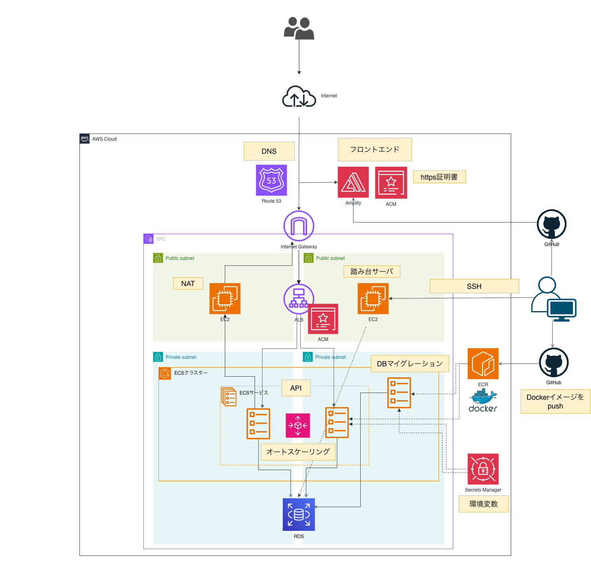
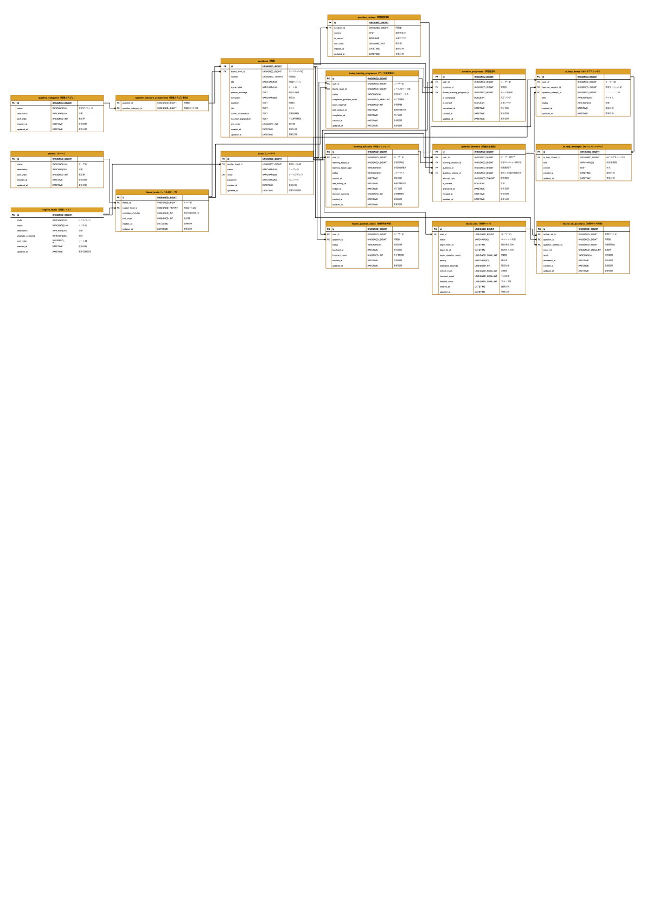

# SceneSpeak API Server

実際の英会話シーンを題材に、選択式問題で "使える英語" を学ぶ学習アプリ **SceneSpeak** のバックエンド API サーバです。

> フロントエンドは別リポジトリで管理しています 👉 <https://github.com/H-F025/scene-speak-frontend>

## 📖 アプリ概要

カフェでの注文やレストランでの会話など、日常の「シーン」ごとに用意された英会話問題を解きながら学習する Web アプリです。ユーザーは自分の英語レベル（初級 / 中級 / 上級）を選び、レベルに合ったテーマ・問題に取り組みます。解答ごとに正誤フィードバックと解説が得られ、間違えた問題は自動で「復習セット」にまとまり、効率的に復習できます。

本リポジトリはその **バックエンド API サーバ**（Laravel）で、認証・テーマ / 問題の配信・学習セッション管理・復習セット・学習履歴などの機能を REST API として提供します。

## 💡 制作背景

- 英語学習アプリは数多くありますが、「実際の会話シーンで何と言えばよいか」に特化し、シーンに没入しながら学べるものは多くありません。この課題感から、シーンベースの学習体験を提供したいと考え制作しました。
- 単なる暗記ではなく、"間違えた問題を優先的に復習する" 仕組み（復習セット）によって、記憶の定着と学習の継続を後押しすることを狙いとしています。
- ポートフォリオとして、Laravel によるトークン認証付き REST API の設計と、AWS ECS（Fargate）を用いたコンテナ運用・CI/CD・インフラ構築を一通り実践することを目的としています。

## ✨ 主な機能

- **認証**（Laravel Sanctum によるトークン認証）: 会員登録 / ログイン / ログアウト / ログインユーザー情報の取得
- **英語レベル設定**: 初級・中級・上級から選択、後からの変更も可能
- **テーマ / 問題**: レベル別のシーンテーマ一覧、テーマごとの問題取得
- **学習セッション**: 学習の開始・heartbeat による滞在時間の計測・終了、学習状態（status）の管理
- **問題解答 & フィードバック**: 選択式解答、正誤判定、正解 / 不正解それぞれの解説表示
- **復習セット**: 間違えた問題を優先度付きで束ね、復習の実施と結果集計
- **学習履歴**: これまでの学習・解答履歴の閲覧
- **ホーム**: 学習状況のサマリ表示

## 🛠 技術スタック

| 分類 | 使用技術 |
| --- | --- |
| 言語 | PHP 8.3 |
| フレームワーク | Laravel 13 |
| 認証 | Laravel Sanctum（トークン認証）|
| DB | 開発: MySQL 8.4（Docker）/ 本番: Amazon RDS |
| テスト | PHPUnit 12 |
| コード整形 | Laravel Pint |
| ログ確認 | Laravel Pail |
| インフラ | AWS（ECS Fargate / ALB / RDS / ECR / Amplify 他）|
| コンテナ | Docker |
| CI/CD | GitHub → ECR（Docker イメージ push）→ ECS |

> フロントエンドは別リポジトリで管理し、ホスティングは AWS Amplify を利用しています。

## 🏗 インフラ構成図



- **Route 53**: DNS。ユーザーからのアクセスを受け付けます。
- **Amplify + ACM**: フロントエンド（別リポジトリ）を GitHub 連携でデプロイし、HTTPS 証明書を付与します。
- **ALB + ACM**: API への HTTPS リクエストを ECS へロードバランシングします。
- **ECS クラスター（Fargate）**: API を Private subnet で稼働。ECS サービス / オートスケーリング / DB マイグレーション用タスクを構成します。
- **RDS**: Private subnet に配置したデータベース。
- **NAT / Internet Gateway**: サブネットの外部通信・受信を制御します。
- **踏み台サーバ（EC2）**: SSH 経由で Private リソースへ保守アクセスします。
- **ECR + Docker**: GitHub からビルドした Docker イメージを push し、ECS がデプロイします。
- **Secrets Manager**: 環境変数・シークレットを管理します。

## 🗄 ER図



主なテーブル: `users` / `english_levels` / `themes` / `theme_levels` / `questions` / `question_choices` / `question_categories` / `learning_sessions` / `question_attempts` / `review_sets` / `review_set_questions` / `review_question_states` / `theme_learning_progresses` / `question_progresses`

## 🔌 API エンドポイント（抜粋 / prefix: `/api/v1`）

| Method | Path | 概要 |
| --- | --- | --- |
| POST | `/auth/register` | 会員登録 |
| POST | `/auth/login` | ログイン |
| GET | `/auth/me` | ログインユーザー取得 |
| POST | `/auth/logout` | ログアウト |
| GET | `/home` | ホーム情報 |
| GET | `/histories` | 学習履歴 |
| GET | `/english-levels` | 英語レベル一覧 |
| PATCH | `/me/english-level` | 英語レベル更新 |
| GET | `/themes` | テーマ一覧 |
| GET | `/themes/{theme_level_id}/questions` | テーマの問題一覧 |
| POST | `/learning-sessions` | 学習セッション開始 |
| POST | `/learning-sessions/{id}/heartbeat` | 滞在時間更新 |
| POST | `/learning-sessions/{id}/finish` | 学習セッション終了 |
| GET | `/learning-sessions/{id}/questions/{qid}` | 問題取得 |
| POST | `/learning-sessions/{id}/questions/{qid}/answer` | 解答 |
| GET | `/question-attempts/{id}` | 解答フィードバック |
| GET / POST | `/review-sets` | 復習セット取得 / 作成 |
| GET | `/review-sets/{id}/questions/{qid}` | 復習問題取得 |
| POST | `/review-sets/{id}/questions/{qid}/answer` | 復習問題解答 |
| GET | `/review-sets/{id}/completion` | 復習完了サマリ |

## 🚀 ローカル環境構築

Docker Compose（nginx + PHP-FPM + MySQL 8.4）で動作します。事前に Docker / Docker Compose をインストールしてください。

```bash
# 1. 環境変数ファイルを用意
cp .env.example .env

# 2. コンテナをビルドして起動（app / nginx / mysql）
docker compose up -d --build

# 3. 依存パッケージのインストール
docker compose exec app composer install

# 4. アプリケーションキーの生成
docker compose exec app php artisan key:generate

# 5. マイグレーション & シーディング
docker compose exec app php artisan migrate --seed
```

起動後は <http://localhost:8080> で API にアクセスできます。

テストの実行:

```bash
docker compose exec app php artisan test
```